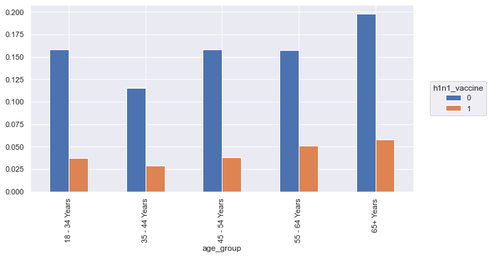
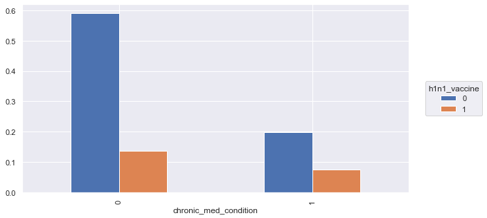
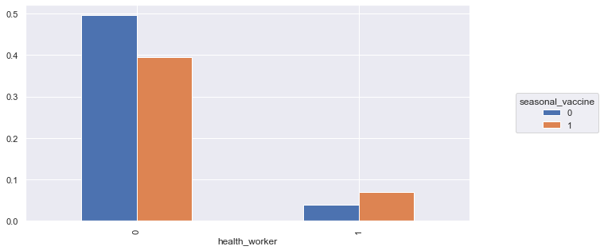
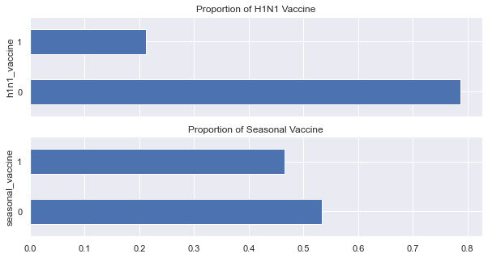

<h1 align="center">Projeto para Análise de Adesão à Vacina H1N1 e Vacinal Sazonal de Gripe no ano de 2012</h1>

<h1 align="center">
  
</h1>

O objetivo principal deste projeto é analisar os dados sobre a incidência de vacinação contra o H1N1 e a gripe sazonal em um grupo de indivíduos que residiam há 6 meses ou mais nos Estados Unidos no ano de 2009, buscando entender quais grupos tendem ou não a recusar a oportunidade de vacinação e quais fatores levam tais indivíduos a essa escolha. Dessa forma, é possível estudar sobre quais grupos podem receber uma maior conscientização para ocorrer engajamento da vacinação em situações de crise sanitárias.

<h1 align="center">Questão e Entendimento de Negócio</h1>

1.	Contexto da Problemática

Realizou-se uma reunião em uma secretaria de saúde hipotética para discutir quais grupos tendem ou não a recusar a oportunidade de vacinação e quais fatores levam tais indivíduos a essa escolha. A necessidade surgiu devido a intenção de se fomentar a conscientização direcionada nos grupos e nas razões de porque indivíduos escolhem não se vacinar.

<h1 align="center">Desenvolvimento do Projeto</h1>

São apresentadas duas tabelas no DataSet: a Tabela "training_set_features", que contém dados sobre os entrevistados, quais seus costumes incentivados pela Organização de Saúde, qual o posionamento dos médicos que os atendem, etc e a Tabela "training_set_labels", que apresenta as informações sobre qual a adesão à vacinação de H1N1 ou Sazonais.

1.	Descrição dos Dados

Uma das primeiras partes do projeto é realizada no estudo do tipo de dados que temos disponíveis para o desenvolvimento do projeto. Nessa etapa são obtidos conhecimentos sobre os dados tabelados: qual a quantidade de observações e atributos apresentados, quais os tipos de atributos, etc.

2.	Feature Engineering

Na etapa de Feature Engineering são selecionadas as melhores features para o modelo de predição, criação de novas features derivadas das originárias e transformação matemática de features para que seja utilizada ao máximo a maior quantidade de dados possíveis do dataset.

- Missing Values:

No caso de dados ausentes podem ser aplicados alguns métodos: excluir ou preencher os dados faltantes. Este projeto é desenvolvido para crianção de insights, foi escolhida a técnica de KNN para preencher os dados faltantes.

<h1 align="center">Mapa Mental de Hipóteses</h1>

O Mapa Mental pode ser utilizado como um “guia” para observar quais são as variáveis mais importantes para a Análise Exploratória dos Dados e quais serão mais relevantes para a criação das hipóteses sobre o desenvolvimento e insights que serão apresentados. Dado que o projeto tem a finalidade de predição de vendas, devemos selecionar as variáveis que serão agentes para tal objetivo e quais atributos destes são mais importantes para a validação das hipóteses.

<h1 align="center">
  
</h1>

No centro do mapa mental podemos observar o objeto de análise “Flu Shot”, seguido pelo primeiro patamar das ramificações apresentando as variáveis agentes que impactam diretamento no 'target' vacinado ou não vacinado e logo após, os atributos que caracterizam tais agentes. Essa análise é importante para que quando for realizada a lista sobre hipóteses que serão apresentadas pelo nosso projeto, as variáveis necessárias para validar tal sugestão estejam disponíveis.

<h1 align="center">Análise Exploratória de Dados</h1>

Após a filtragem de hipóteses serão realizadas as análises sobre as features e como estas agem sozinhas ou em combinação com outras features. O projeto teve quinze hipóteses finais que foram validadas ou refutadas pelo estudo gráfico de cada uma delas (informações apresentadas no notebook). Concluindo-se o estudo e validação das hipóteses, é possível indicar quais features terão maior ou menor relevância no "target" vacinação. 

<h1 align="center">Melhores Insights - Hipóteses</h1>

H1. Indivíduos mais jovens tendem vacinar-se mais

Falso: A maior vacinação ocorrem em pessoas com 65 anos ou mais.

  

H2. Indivíduos com doenças crônicas tendem vacinar-se mais

Falso: Há uma queda vacinação de pessoas com doenças crônicas (para H1N1).

  

H3. Profissionais da saúde tendem a vacinar-se mais
Verdadeiro para Gripes Sazonais

Verdadeiro.

  

H3. H4. Indivíduos tendem a vacinar-se mais contra gripes comuns
Verdadeiro.

  

<h1 align="center">Referências</h1>
https://www.drivendata.org/competitions/66/flu-shot-learning/   - Acesso em: 30/11/2021

